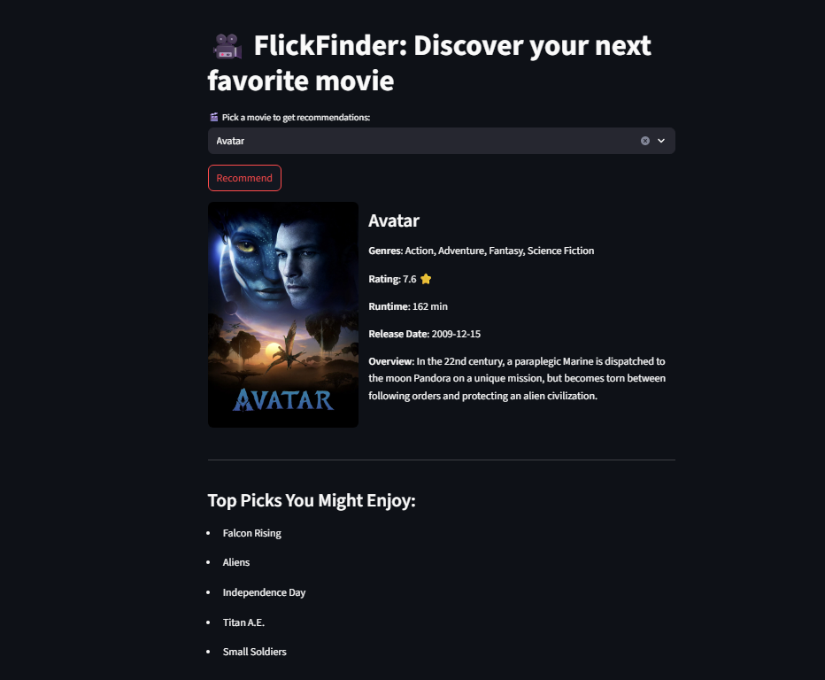

# 🎬 FlickFinder: Movie Recommendation System Using NLP & TMDB API

FlickFinder is a content-based movie recommendation system built using NLP techniques and cosine similarity. It suggests movies similar to a selected one based on cast, crew, genres, keywords, and movie overviews. The system integrates the TMDB API to display detailed information and posters of the searched movie. The project also features a user-friendly Streamlit web application.



---

## 📁 Dataset Source

- **Kaggle Dataset**: [TMDB Movie Metadata](https://www.kaggle.com/datasets/tmdb/tmdb-movie-metadata)
- **Files used**:
  - `tmdb_5000_movies.csv`
  - `tmdb_5000_credits.csv`

---

## 🧹 Data Preprocessing

- Initially, **3 missing overviews** were found and **manually filled**.
- Selected essential columns:
  ```
  ['genres', 'movie_id', 'keywords', 'overview', 'title', 'cast', 'crew']
  ```
- From `cast`, the **top 3 actor names** were extracted.
- From `crew`, only the **director's name** was extracted.
- All relevant text information (overview, genres, keywords, actors, director) was combined into a new column:  
  ```
  'tags'
  ```
- Final columns used for modeling:
  ```
  ['movie_id', 'title', 'tags']
  ```
- **Lemmatization and text preprocessing** were done using the **spaCy small model (`en_core_web_sm`)**.

---

## ⚙️ Feature Engineering

- Tried applying **custom weights**:
  - **Low weight to overview**
  - **High weight to tags** (since tags include important data like keywords, genres, actor/director names)
- **Outcome**: Custom weighting didn't improve recommendation performance, so it was **discarded**.
  
### 📌 CountVectorizer vs TF-IDF:

- **CountVectorizer** was chosen because:
  - It **retains high-frequency words** (e.g., "action", "Tom Cruise", etc.), which are important in movie content.
- **TF-IDF** downweights frequent words, which **reduced accuracy** for this context (where repetition indicates relevance).

---

## 🧠 Recommendation Logic

- Used **cosine similarity** over the vectorized `tags` column.
- For each selected movie:
  - Retrieved its index in the DataFrame.
  - Fetched similarity scores for all other movies.
  - Sorted and selected the **top 5 most similar movies** (excluding the selected one itself).

---

## 🌐 TMDB API Integration

Used [TMDB API](https://developers.themoviedb.org/) to fetch:

- Poster Image
- Title
- Genres
- Overview
- Rating
- Runtime
- Release Date

🔑 **Note**: You need a personal TMDB API key to use this feature. Replace the placeholder in the code:
```python
TMDB_API_KEY = 'your_api_key_here'
```

---

## 🖥️ Streamlit Web App Features

### 🔹 Input:
- Movie name selected via a searchable dropdown (`st.selectbox`)

### 🔹 Output:
- **Selected Movie Details**:
  - Poster
  - Title
  - Genres
  - Rating
  - Runtime
  - Release Date
  - Overview
- **Top 5 Recommended Movies**:
  - Displayed as **poster-only cards** (minimal, clean UI)

---

## ⚠️ Known Issues

- **TMDB API failure** (e.g., rate limit or connection issues):
  - In such cases, fallback logic displays only the **titles of recommended movies** without extra details/posters.

---

## 🛠️ Tech Stack

- **Python**  
- **Pandas**
- **spaCy** (for NLP)  
- **scikit-learn** (for vectorization & cosine similarity)  
- **Streamlit** (for web UI)  
- **TMDB API** (for movie metadata & posters)

---

## 🙌 Acknowledgements

- [TMDB](https://www.themoviedb.org/) for the movie metadata and API
- [Kaggle](https://www.kaggle.com/datasets/tmdb/tmdb-movie-metadata) for dataset
- Open-source tools and libraries used in the Python ecosystem

---

## ✅ Conclusion

Through this project, I learned how to build a complete end-to-end movie recommendation system using NLP and real-world APIs. I understood the importance of preprocessing steps like lemmatization and combining relevant metadata into a single text representation. I also experimented with different vectorization techniques and discovered why CountVectorizer worked better than TF-IDF for this use case. While trying out weighting techniques, I realized that not all ideas improve performance, and it's okay to discard them after testing. Integrating the TMDB API helped me learn how to work with external APIs and fetch dynamic content like posters and movie details. Streamlit made it easy to build an interactive and user-friendly web app. Finally, I learned how to handle fallback cases gracefully when the API fails. This project strengthened my skills in NLP, feature engineering, API handling, and web app deployment — and gave me the confidence to build more real-world AI tools.


